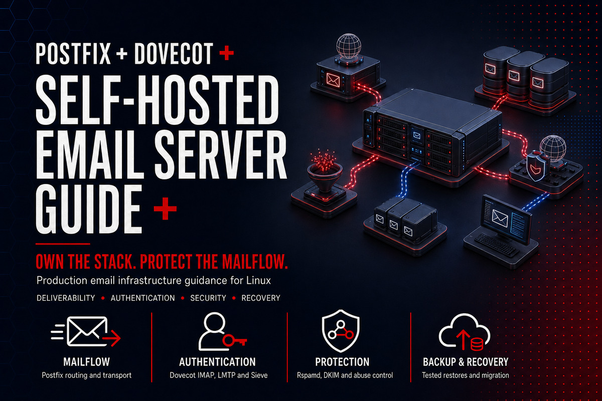

# Self-Hosted Email Server Guide

  

An operations-first, security-focused guide for designing, deploying, validating, and recovering a self-hosted email platform on Debian 13.

The reference architecture uses Postfix, Dovecot, MariaDB, Rspamd, Redis, Roundcube, Nginx, and ACME certificates. It is deliberately vendor-neutral at the DNS, monitoring, backup, and identity boundaries.

> Self-hosting email is an ongoing operational commitment. Deliverability, abuse response, patching, key rotation, certificate renewal, backups, and restore testing remain the operator's responsibility.

## Design goals

- No open relay and no clear-text authentication.
- Separate SMTP reception, authenticated submission, mailbox delivery, filtering, and webmail trust boundaries.
- Virtual domains and mailboxes with least-privilege database identities.
- SPF, DKIM, DMARC, PTR, TLS, MTA-STS, and TLS-RPT planned as one control system.
- Reversible changes, explicit acceptance gates, and tested recovery.
- Read-only validation scripts that do not alter production state.

## Reference stack

| Layer | Baseline | Responsibility |
|---|---|---|
| Operating system | Debian 13 | Supported packages, systemd, nftables |
| Mail transfer | Postfix 3.10 | SMTP, submission, routing, queue |
| Mail access | Dovecot 2.4 | IMAP, LMTP, SASL, Sieve |
| Identity data | MariaDB | Virtual domains, users, aliases |
| Filtering | Rspamd + Redis | Spam scoring, policy, DKIM signing |
| Webmail | Roundcube 1.7+ | Browser client only; no mail authority |
| Edge HTTP | Nginx | TLS termination for webmail and MTA-STS |
| Certificates | ACME client | Automated issuance and renewal |

Always confirm the exact package versions and syntax on the target host before applying examples.

## Guide map

1. [Requirements and threat model](docs/01-requirements-and-threat-model.md)
2. [Architecture and trust boundaries](docs/02-architecture-and-trust-boundaries.md)
3. [DNS and network prerequisites](docs/03-dns-and-network-prerequisites.md)
4. [Debian host baseline](docs/04-debian-host-baseline.md)
5. [Postfix mail flow](docs/05-postfix-mailflow.md)
6. [Dovecot mailbox and authentication](docs/06-dovecot-mailbox-and-authentication.md)
7. [Virtual domains, users, and SQL](docs/07-virtual-domains-users-and-sql.md)
8. [TLS and certificate lifecycle](docs/08-tls-and-certificate-lifecycle.md)
9. [SPF, DKIM, and DMARC](docs/09-spf-dkim-dmarc.md)
10. [Rspamd and abuse control](docs/10-rspamd-and-abuse-control.md)
11. [Roundcube webmail](docs/11-roundcube-webmail.md)
12. [Backup and recovery](docs/12-backup-and-recovery.md)
13. [Monitoring, logging, and alerting](docs/13-monitoring-logging-and-alerting.md)
14. [Migration and cutover](docs/14-migration-and-cutover.md)
15. [Troubleshooting and incident response](docs/15-troubleshooting-and-incident-response.md)
16. [Lifecycle, upgrades, and decommissioning](docs/16-lifecycle-upgrades-and-decommissioning.md)

## Quick start

1. Copy [deployment-workbook.md](templates/deployment-workbook.md) and record owners, domains, volumes, RTO/RPO, IP reputation, and rollback criteria.
2. Complete the architecture and DNS chapters before installing packages.
3. Copy [deployment.env.example](examples/deployment.env.example) to a protected local workspace and replace placeholders. Do not commit it.
4. Run the read-only preflight:

~~~bash
sudo ./scripts/mail-server-preflight.sh
~~~

5. Build in an isolated environment, test external delivery in both directions, then execute the cutover runbook.

## Safety model

The scripts collect facts and perform network checks. They do not install packages, modify configuration, change DNS, open firewall ports, issue certificates, create users, delete mail, or restart services. Review every command and output before using it as change evidence.

Examples use reserved domains and documentation address ranges. Never paste real credentials, DKIM private keys, mailbox exports, or customer data into issues or commits.

## Operational references

- [Ports and protocols](reference/ports-and-protocols.md)
- [DNS record reference](reference/dns-record-reference.md)
- [Security control catalog](reference/security-control-catalog.md)
- [Architecture decisions](reference/architecture-decisions.md)
- [Limitations](reference/limitations.md)
- [Primary sources](reference/sources.md)

## Project status

Version 1.0.0 is the initial production-oriented baseline. See [ROADMAP.md](ROADMAP.md) for planned additions and [CHANGELOG.md](CHANGELOG.md) for release history.

## License and support

Documentation and scripts are released under the [MIT License](LICENSE). Community support is provided through GitHub issues. This project is not a managed email service and provides no deliverability guarantee.
